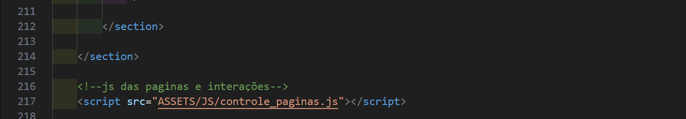

## Para realizar as trocas de página
-> No momento as páginas estão sendo trocadas usando js (ASSETS/JS/controle_pagina.js)
-> Quando for fazer a troca de pagina ser feita por php só desanexa o script no fim do body do sistema.html (linha 217)
 (ctrl click para abrir a imagem)

->Ai troca os arquivos de página para PHP

## Interface não atualiza
-> As vezes quando uso o wamp para localhost rodar o projeto quando faço alterações no front ele não atualiza, só consigo ver alterações quando o arquivo esta em html.

## Geraçao de interface pelo php
-> A parte de opções de gerenciamento deve ser renderizada em todas telas, aí é só tirar a parte html dessa área + o divisor com simbolo da gkt para fora da main no sistema.html (linhas 155 a 208)

* Página alunos:
    * Tem formulario para filtro ai tu programa lá o php para fazer filtro e gerar itnerface de acordo com a querie sql
    * linha 55 a 96 está o exemplo de geracao de dados do aluno que deve ser criada ao realizar a querie
    basta só fazer alteracoes nos dados informado inclusive no icone de situacao dependendo da querie voltada, o segundo exemplo ja presento no arquivo ALUNOS.html é com a situacao negativa

* Página de castro:
    * Só programar o cadastro dos usuarios no banco de dados sem segredo

* Página turmas:
    * Segue a mesma ideia para a página alunos porém o filtro é mais para as artes marciais
    * tem lá o form pra fitlrar o exemplo que deve ser gerado quando for filtrado algo
    * tem tambme mensagem de caso a pesquisa não retorne nada